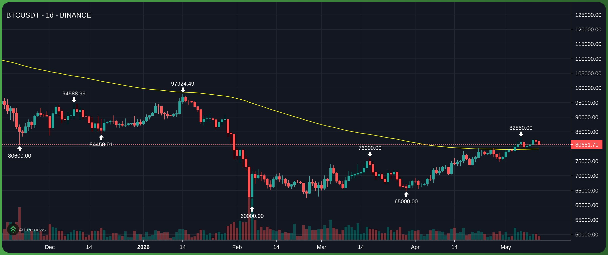

### **EMA 147: The Weekly Trend Filter**

The **EMA 147** is a technical indicator designed to show the **Weekly EMA 21** trend while looking at a **Daily** chart.

---

### **1. The Logic**

It serves as a "Timeframe Bridge." Instead of switching back and forth between charts, you use the 147 to see higher-timeframe momentum instantly.

* **The Math:** $21 \text{ weeks} \times 7 \text{ days} = 147 \text{ days}$.
* **The Result:** The EMA 147 on a daily chart is identical to the EMA 21 on a weekly chart.

---

### **2. Core Functions**

* **Trend Barrier:** It acts as the "Line in the Sand."
* **Price Above 147:** Bullish (Long-term strength).
* **Price Below 147:** Bearish (Long-term weakness).

* **Value Area:** In a healthy trend, price often pulls back to the EMA 147 to "retest" its long-term average before continuing the move.
* **Noise Reduction:** It ignores daily volatility, providing a smooth line that represents the true market direction over the last 5 months.

---

### **3. Strategic Use**

| Feature | EMA 21 (Daily) | EMA 147 (Daily) |
| --- | --- | --- |
| **Role** | Short-term Momentum | Long-term Trend (Weekly) |
| **Reaction** | Fast / Sensitive | Slow / Stable |
| **Trade Use** | Entry & Exit signals | Directional bias (Don't trade against it) |

> **Pro Tip:** When the **Daily EMA 21** crosses above the **EMA 147**, it is often viewed as a major trend shift, indicating that short-term momentum is now aligned with the long-term cycle.
